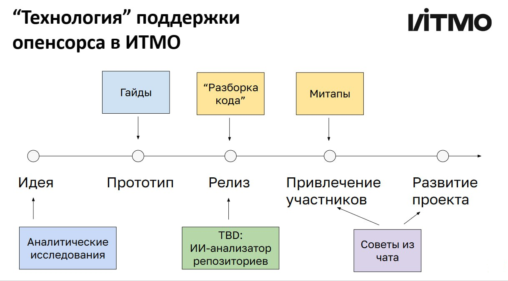

Мы помогает открытым проектам ИТМО на различных этапах их жизненного цикла. 
Это можно формализовать в рамках такой технологии:

Инструмент для ИИ-анализа репозиториев (мы назвали его [OSA](https://github.com/ITMO-NSS-team/Open-Source-Advisor)) 
находится в разработке и будет представлен в 2025 году.