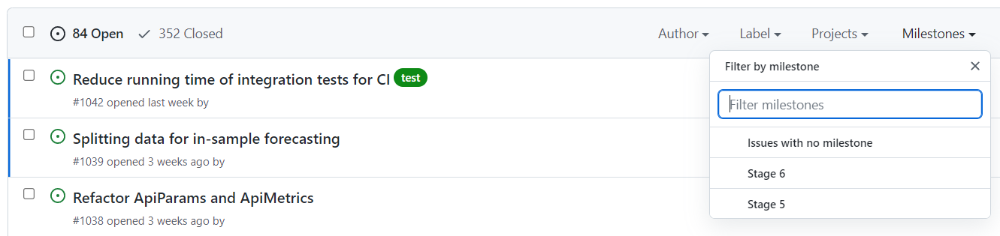
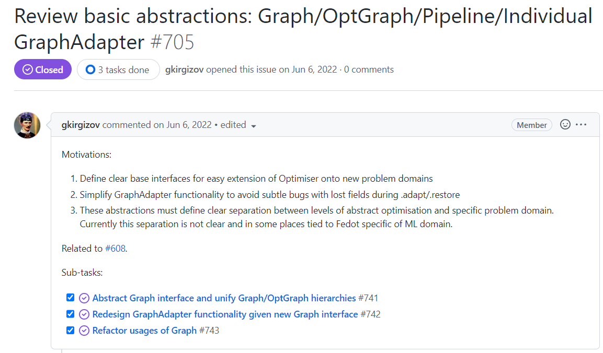
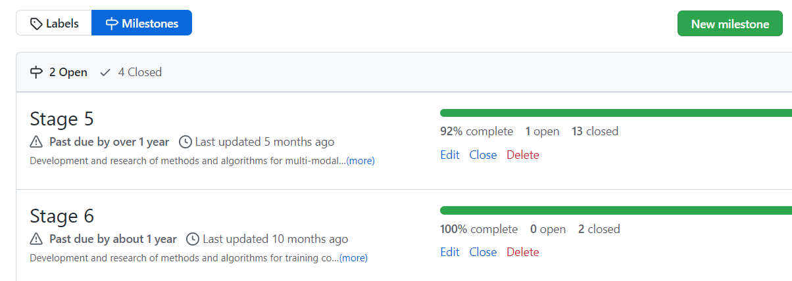
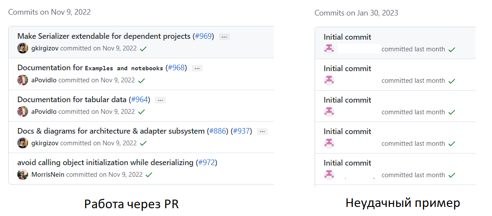

# Особенности организации управления open-source проектом.

Открытый проект отличается от классической заказной проектной разработки.
Основное, на наш взгляд, отличие - необходимость участия в проекте "временных", 
не всегда высокомотивированных участников - внешних контрибьюторов.

Как можно улучшить организацию управления открытым проектом?

## Репозиторий

#### Как можно раньше создать конкретный репозиторий, над которым идет работа. 

Чем раньше будет виден образ результата проекта (итеративно улучшающийся в дальнейшем) - 
тем проще и удобнее для всех.

В дополнение к главному репозиторию могут существовать вспомогательные репозитории-зависимости, 
но они всё-таки вторичны. 
Когда работа идет одновременно над множеством равноправных модулей, 
внешнему участнику объективно сложно понять, в чем смысл его участия в каждом их них.

## Открытые задачи

#### Иметь открытое описание проекта, имеющихся в рамках него задач и их исполнителей, крайних сроков и имеющихся milestone.

Нередки ситуации, когда описание проекта и разделение задач 
между членами команды содержится преимущественно в личных знаниях руководителя и исполнителей. 
Поэтому для любой синхронизации требуется созвоны и личные переписки. 

Для open-source проектов желательно фокусирование работы в рамках репозитория. 
Это, помимо прочего, позволяет внешним участникам понять, что проект "жив" и в нем есть смысл участвовать.

Такой формат не исключает проведения дистанционных и даже очных встреч и семинаров. 
Но итоги таких обсуждений должны фиксироваться в виде issue - 
иначе часть контрибьюторов о них попросту не узнает.

Большие issues лучше разбивать на под-задачи - это позволит лучше контролировать процесс решения задач. 
При этом возможно настроить связь между основным и вспомогательными issue:

На issue, взятые в работу, должен назначаться исполнитель (assignee).
Обработанные issue нужно оперативно закрывать 
(если они связаны с PR-ами - это произойдет автоматически при их вливании в master).

Для управления большим числом issue можно использовать 
встроенный в GitHub таск-трекер "Projects" или внешний инструмент.

Также issue удобно привязывать к этапа проекта - milestone-ам. 
Тогда для каждого майлстоуна будет указан перечень issues, которые планируется выполнить в рамках этапа.
Создать их на GitHub-е можно в разделе "Issues - Milestones".

## Pull Request-ы и Code Review

#### Если над репозиторием работает больше одного человека, то лучше избегать прямых коммитов в master.

Лучше использовать механизм Pull Request-ов (Merge Request в терминологии gitlab), т.к. он:
1) Позволяет структурировать вносимые изменения и соотносить их с конкретной задачей;
2) Обеспечивает уведомления пользователей о новых изменениях;
3) Позволяет организовать code review (что особенно важно при привлечении начинающих разработчиков).

Даже поверхностное рецензирование позволяет избежать множества проблем, например:

1) Включения в коммит лишних файлов;
2) Неверного разрешения конфликтов;
3) Потери актуальности примеров и документации.

Существуют различные схемы назначения рецензентов для Pull Request. 
Назначение рецензента может выполняться автором изменений или руководителем проекта.

Для команд большего размера может использоваться отдельный канал для обсуждений, 
куда вносятся запросы на рецензирование и ищутся желающие их взять на себя.

Важно как соответствие набора изменений навыкам рецензента, 
так и равномерность нагрузки на участников команды. 

В идеале, навыками выполнения Code Review должны владеть все разработчики. 
Участие в ревью - отличный способ для неопытных разработчиков влиться в проект
и повысить свои навыки.

Для сокращение затрат времени на ревью целесообразно использовать в репозиториии авто-проверки 
(например, на соотвествие code-style требованиям PEP8).

Типовой сценарий жизненного цикла задачи таков:

1) Для задачи создается новый issue с кратким описанием и возможным решением. 
2) Вся информация о прогрессе выполнения задачи агрегируется там.
3) В рамках решения этого issue создается новая ветка от master ветки.
4) После внесения commit-ов в этой ветке, создается Pull Request - запрос на внесение изменений в другую ветку (обычно - master).
5) В Pull Request ревьюеры просматривают внесенные изменения и, если необходимо, запрашивают правки.
6) Исправления происходят в той же ветке, пересоздавать PR не требуется. 
Когда набор изменений готов к повторному ревью, можно нажать кнопку "Re-request review"
7) На каждое замечание автор PR оставляет комментарий. 
Если рецензент согласен с исправлением, он нажимает "Resolve".
8) После ревью изменения можно влить в master. 