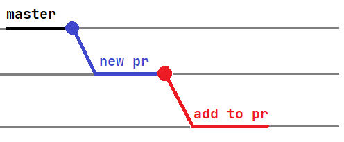

# Исскуство "правильного" Pull Requests-а

О практиках создания правильных Pull Request-ов (PR) и выполнения в них Code Review написано немало 
(например: [Making a Pull Request](https://www.atlassian.com/git/tutorials/making-a-pull-request),
[Git - Pull request на практике](https://www.youtube.com/watch?v=G_HKJJLozUc)).

В этом руководстве хотелось бы остановиться на некоторых конкретных советах по организации технической стороны процесса:

- Не забывайте давать PR-ам описание. Это экономит время всех участников процесса.

- Не забывайте нажимать re-request review,  когда исправили все замечания рецензента (на текущей итерации правок);

- На каждый комментарий рецензента должен быть дан ответ. 
  Если всё очевидно, то это может быть просто "Done" 
  (можно использовать эмодзи - но они не порождают уведомлений, что не очень удобно); 
  Если изменения не-тривиальны - то лучше дать подробный ответ. В "сложных" случаях можно давать ссылки на строки кода.

- Сворачивать комментарии с помощью resolve автору не стоит - это делает рецензент.
    Изменения не всегда принимаются с первого раза, а найти свёрнутый комментарий - сложно

В ситуации, когда вы рецензируете чей-то PR, и возникает необходимость не только оставить комментарии, 
  но и что-то исправить самостоятельно, лучше создавай новый PR - 
но не в master, а в ветку, связанную с существующим PR-ом:

Рецензентом следует назначать автора исходного PR-а. Такой подход позволяет вести дискуссию по правкам более удобно и  в целом сделать работу над веткой
  более предсказуемо - иначе автор может не заметить, что пришел новый коммит - что приведет к решению избыточные конфликты. 
  Это не относится к самоочевидным изменениям (вроде правок грамматики). Но в любом случае, внося новый коммит - оставляйте комментарий для автора.

- https://github.com/aimclub/FEDOT/pull/902 - рефакторинг объемного кода;
- https://github.com/aimclub/FEDOT/pull/990 - изменения среднего размера;