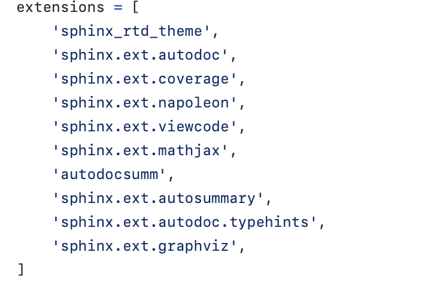
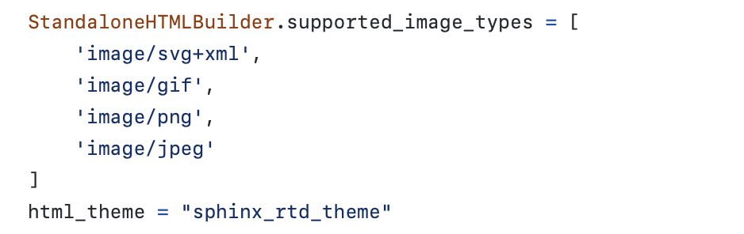
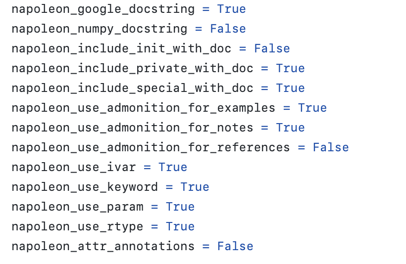
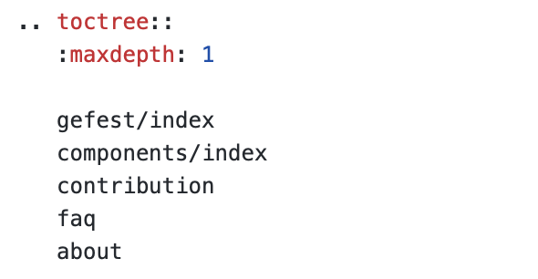
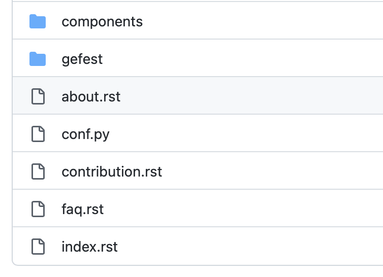
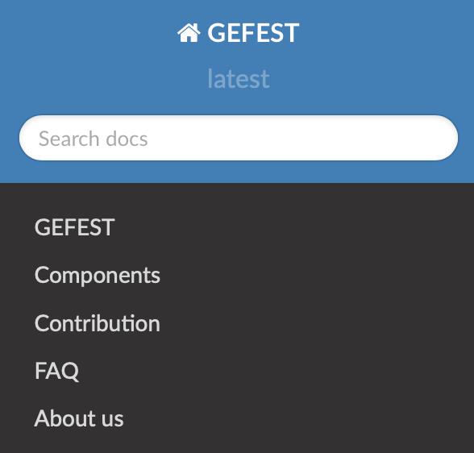
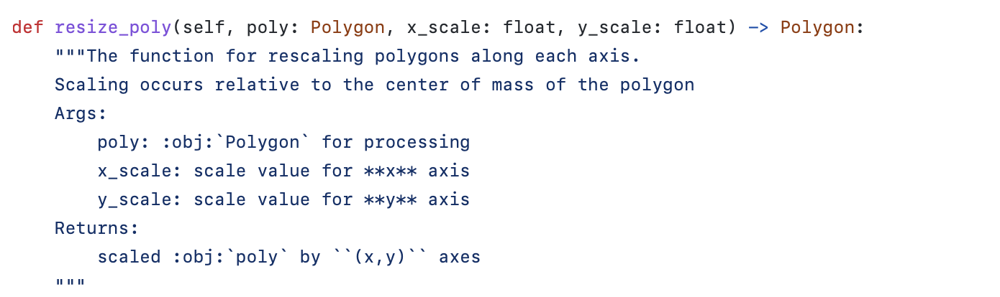
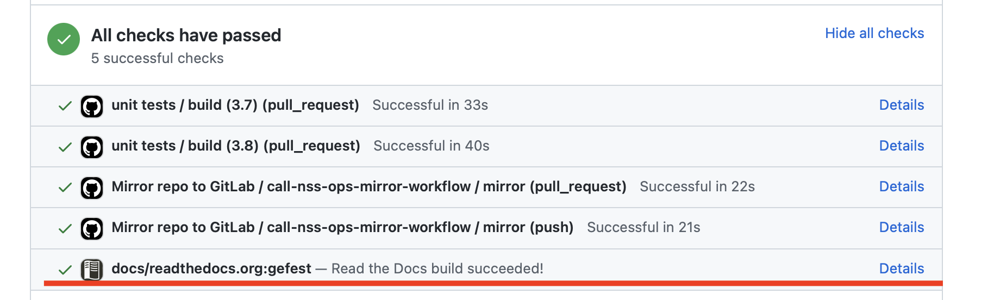
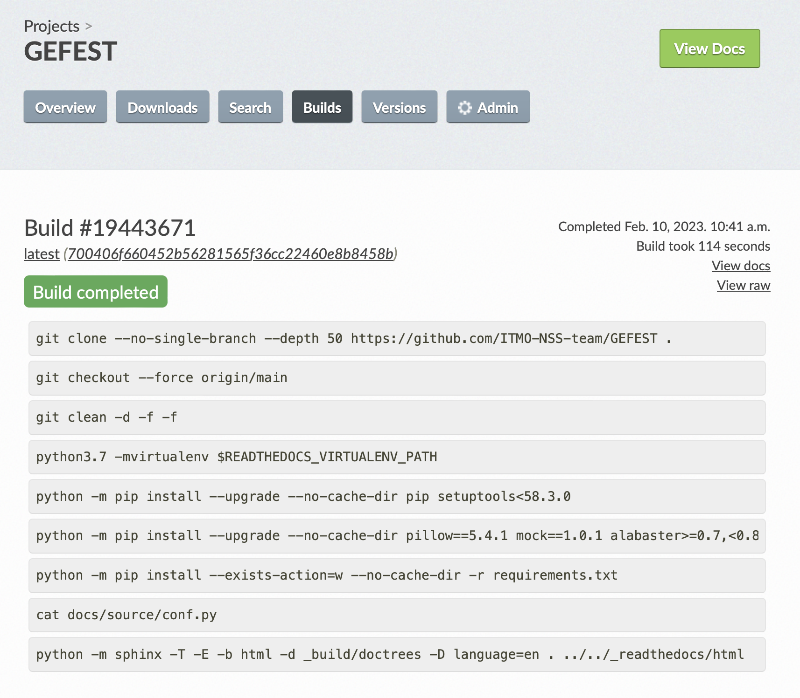
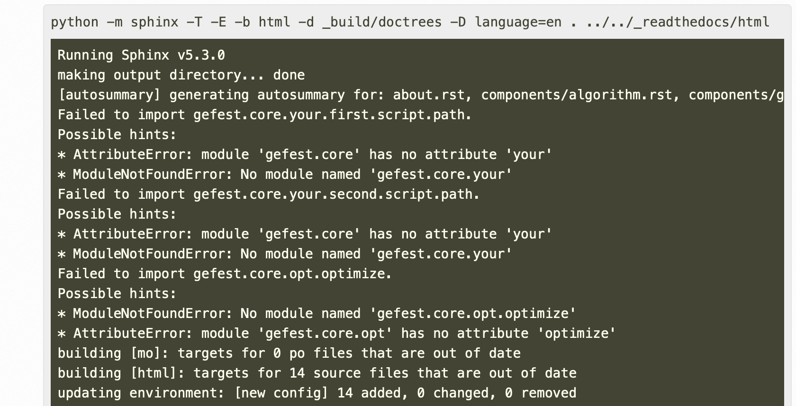

Руководство по документированию проекта
#######################################

1. Создание профиля Read The Docs
*********************************

Создать сайт с документацией по проекту можно с помощью сервиса `Read the Docs <https://readthedocs.org>`_.
Для этого необходимо проделать несколько шагов, описанных ниже.

1.1 Создание профиля (аккаунта) проекта
=======================================

После регистрации аккаунта на сайте **readthedocs.org** необходимо связать аккаунт с GitHub аккаунтом, владеющим проектом, который 
необходимо документировать. 
Эта процедура настраивается с помощью **"Import a Project -> Connect to GitHub -> Выбор репозитория из списка доступных"**

После интеграции проекта в среду Read The Docs вы увидите доступный для настройки проект

.. image:: images/rtd_projects.png
    :width: 650

1.2 Настройки проекта
=====================

В разделе **"Admin -> Advanced Settings"** важно и нужно:

1. Назначить ветку проекта, из которой будет собираться основная (стабильная) версия документации.

   .. image:: images/default_branch.png
       :width: 300

2. Позволить сборку документации на основе Pull Request.

   .. image:: images/build_pr.png
        :width: 300
    
 Эта функция позволяет автоматически собирать документацию после каждого коммита в PR

3. Добавить контрибьютора в проект (если нужно).

   .. image:: images/add_contributor.png
        :width: 300

 Контрибьютор должен зарегистрироваться на сайте **readthedocs.org**, добавить его к проекту можно, используя электронную почту.
 
 Для добавления нового участника перейдите в **"Admin -> Maintainers"**

2. Создание структуры документации в репозитории
************************************************

Для того, чтобы в системе Read The Docs собиралась документация из репозитория необходимо в самом репозитории 
создать "структуру" собираемой документации. Глобально, вся структура документации и настройки её отображения содержатся в директории ``docs``, а 
корне репозитория располагается манифест ``.readthedocs.yml``, позволяющий "активировать" сборку документации.
В качестве примера организации структуры можно заглянуть в `open-source проект <https://github.com/aimclub/GEFEST>`_.

Создать начальную структуру документации внутри проекта можно **2 способами**:

   1. С помощью библиотеки sphinx:
   
     **Шаг 1**. `Установка библиотеки локально <https://www.sphinx-doc.org/en/master/usage/installation.html>`_

     **Шаг 2**. `Создание структуры документации с помощью команды <быстрой настройки https://www.sphinx-doc.org/en/master/usage/quickstart.html>`_

   2. Импортировать готовые настройки из стороннего проекта:
   
     **Шаг 1**. В корень репозитория скопировать манифест `.readthedocs.yml <https://github.com/aimclub/GEFEST/blob/main/.readthedocs.yml>`_ (можно копировать без внесения правок)

     **Шаг 2**. В корень репозитория скопировать директорию `docs <https://github.com/aimclub/GEFEST/tree/main/docs>`_ 

     **Шаг 3**. Внутри директории ``docs`` удалить ``tutorials``, очистить от изображений директорию ``img`` (в дальнейшем в этой директории будут храниться все изображения вашей документации)

     **Шаг 4**. Внутри директории ``docs->source`` оставить только файлы ``index.rst``, ``conf.py`` (значение этих файлов и работа с ними описана ниже)

3. Настройка конфигураций проекта документации
**********************************************

Для корректной сборки документации проекта в большинстве случаев будет достаточно импортировать существующие 
конфигурации по пути ``docs -> source -> conf.py`` из стороннего проекта, например `GEFEST <https://github.com/aimclub/GEFEST/blob/main/docs/source/conf.py>`_
и изменить первую часть конфиг файла, заменив имя проекта и автора. Однако, целью данного руководства является внесение ясности в суть имеющихся настроек.

3.1 General configuration
=========================

В данном разделе в переменную ``extensions`` необходимо поместить список расширений, которые необходимы для корректной сборки документации

Описание некоторых из них:

   - ``sphinx_rtd_theme`` - устанавливает тему отображения документации (альтернатива - ``alabaster``)
   - ``sphinx.ext.autodoc`` - позволяет формировать документацию из докстрингов 
   - ``sphinx.ext.napoleon`` - добавляет в окружение проекта пакет *napoleon*, способный расширять функционал отображения документации
   - ``sphinx.ext.viewcode`` - возможность отображения блоков кода в документации
   - ``sphinx.ext.mathjax`` - возможность отображения математических формул
   - ``sphinx.ext.graphviz`` - дополнительный функционал для отображения графиков и другой визуализации

Каждый проект требует собственного набора расширений для той или иной задачи, основные можно найти `в документации по extensions <https://www.sphinx-doc.org/en/master/usage/extensions/index.html>`_.

3.2 Options for HTML output
===========================

В данном разделе, по умолчанию, задается только переменная ``html_theme``, однако, если в документацию необходимо добавить, например изображения формата GIF 
нужно добавить дополнительные настройки

Больше информации о настройках можно найти `в документации Html Theming <https://www.sphinx-doc.org/en/master/usage/theming.html>`_.

3.3 Extension configuration
===========================

В данном разделе указываются дополнительные параметры для расширений ``extensions``, которые описаны в ``3.1 General configuration``.

Параметры для **napoleon**:

Больше информации о настройках можно найти `в документации napoleon <https://sphinxcontrib-napoleon.readthedocs.io/en/latest/sphinxcontrib.napoleon.html>`_.

4. Создание разделов документации в репозитории
***********************************************

По умолчанию (в соответствии со стандартными настройками ``.readthedocs.yml``) структура документации строится в директории ``docs -> source`` 
с помощью файла `index.rst <https://github.com/aimclub/GEFEST/blob/main/docs/source/index.rst>`_.

Первое, с чего нужно начать наполнение документации - схема (скелет/иерархия) всей документации. Нужно определить, какие разделы будут присутствовать,
в каком порядке они будут расположены относительно друг друга. Вся эта информация нужна для создания начального файла индексации ``index.rst``, расположенного в директории ``source``.

Например, структура может выглядеть так:

Однако, ``index.rst`` является лишь связующим звеном между файлами, содержащими контент. В сам файл записываются названия файлов с расширением ``.rst``
или же пути в директории до других файлов (собственных для каждой отдельной директории) ``index.rst``

На сайте документации в Read The Docs этот файл помимо начальной страницы, которая выглядит `вот так <https://github.com/aimclub/GEFEST/blob/main/docs/source/index.rst>`_, 
создаст еще и иерархию контента:

В качестве наглядного примера работы созданной структуры можно посмотреть на связку файлов:

`Начальный index.rst <https://github.com/aimclub/GEFEST/blob/main/docs/source/index.rst>`_ содержал в себе запись 
со ссылкой `на другой index.rst <https://github.com/aimclub/GEFEST/blob/main/docs/source/gefest/index.rst>`_ файл в директории ``docs -> source -> gefest -> index.rst``.
В свою очередь, последний файл содержал записи о том, что необходимо в данный раздел "подтянуть" контент из трех файлов: 
`gefest.rst <https://github.com/aimclub/GEFEST/blob/main/docs/source/gefest/gefest.rst>`_, 
`installation.rst <https://github.com/aimclub/GEFEST/blob/main/docs/source/gefest/installation.rst>`_, 
`quickstart.rst <https://github.com/aimclub/GEFEST/blob/main/docs/source/gefest/quickstart.rst>`_.

Таким образом на сайте в `разделе документации GEFEST <https://gefest.readthedocs.io/en/latest/gefest/index.html>`_ появилось три подраздела с контентом
`Intro to GEFEST <https://gefest.readthedocs.io/en/latest/gefest/gefest.html>`_, `Installation from GitHub <https://gefest.readthedocs.io/en/latest/gefest/installation.html>`_,
`Quickstart <https://gefest.readthedocs.io/en/latest/gefest/quickstart.html>`_.

Синтаксис ReStructuredText (.rst файлов)
========================================

Для того, чтобы информация отображалась корректно необходимо придерживаться корректного синтаксиса.
Как шпаргалку можно использовать `руководство по reStructuredText <https://www.sphinx-doc.org/en/master/usage/restructuredtext/basics.html>`_.

Во время создания таких файлов с контентом удобно использовать встроенные в IDE *preview*, для этого нужно установить 
в среду разработки расширение. `Для VsCode <https://marketplace.visualstudio.com/items?itemName=lextudio.restructuredtext>`_
или `для PyCharm <https://www.jetbrains.com/help/pycharm/restructured-text.html>`_. 

5. Создание докстрингов
***********************

Удобным инструментом для детального описания конкретных методов в проекте является использование докстрингов.

Синтаксис докстрингов может быть разный, однако, данное руководство рекомендует использовать **Google-Style** докстринги
как наиболее удобные в использовании и имеющие интуитивно понятный синтаксис. 

По ссылке можно ознакомиться с правилами и конкретными примерами использования `Google-Style докстрингов <https://sphinxcontrib-napoleon.readthedocs.io/en/latest/example_google.html>`_.

Как "подтянуть" докстринги в документацию?!
===========================================

Оформление страниц документации на сайте Read The Docs, содержащей информацию о методах и классах из докстрингов осуществляется так же через
файлы с расширением ``.rst``. `Пример оформления файла с использованием докстрингов <https://github.com/aimclub/GEFEST/blob/main/docs/source/components/geometry.rst>`_.
`Страница документации, построенная с помощью данного файла <https://gefest.readthedocs.io/en/latest/components/geometry.html>`_. 
`Файл с кодом (контентом в докстрингах) <https://github.com/aimclub/GEFEST/blob/main/gefest/core/geometry/geometry_2d.py>`_.

Из примера видно, что необходимо использовать команду ``.. autoclass:: <path to class>``. Эта команда используется тогда, когда нужно задокументировать докстринги только 
одного конкретного класса во всем файле ``.py``. В случае, когда в документацию необходимо поместить все докстринги из файла с кодом, нужно использовать команду 
``.. automodule:: <path to class>``.

Подробнее о том, какие настройки отображения можно применить к данным командам в `руководстве по autodoc <https://www.sphinx-doc.org/en/master/usage/extensions/autodoc.html>`_.

6. Сборка документации
**********************

После того, как создана структура документации, необходимо запустить процесс ее сборки.

Сборку документации можно выполнить локально (чтобы отследить корректность сборки и исправить ошибки сразу)
с помощью пакета `Sphinx <https://www.sphinx-doc.org/en/master/usage/quickstart.html>`_ и команды ``make html``.

Однако, отсутствие ошибок локально не гарантирует корректность сборки на сервере Read The Docs.
Например, могут различаться версии Python, в таком случае часть документации не соберется из-за несовместимости синтаксиса кода. 

В тот момент, когда происходит отправка очередного коммита с документацией в Pull Request на GitHub, документация начинает собираться автоматически:

Для того, чтобы проверить корректность сборки, необходимо перейти в личный кабинет на сайте **readthedocs.org**, зайти в проект и 
перейти в раздел **"Сборки/Builds"**

Последняя вкладка в данном разделе содержит лог сборки. Именно здесь можно найти причины некорректной сборки документации,
в данном случае, например, в одном из ``.rst`` файлов некорректно использован синтаксис ReStructuredText.

7. Поддержка
************

Вы всегда можете получить поддержку по созданию документации, задав вопрос через страницу `support <https://readthedocs.org/support/>`_.
