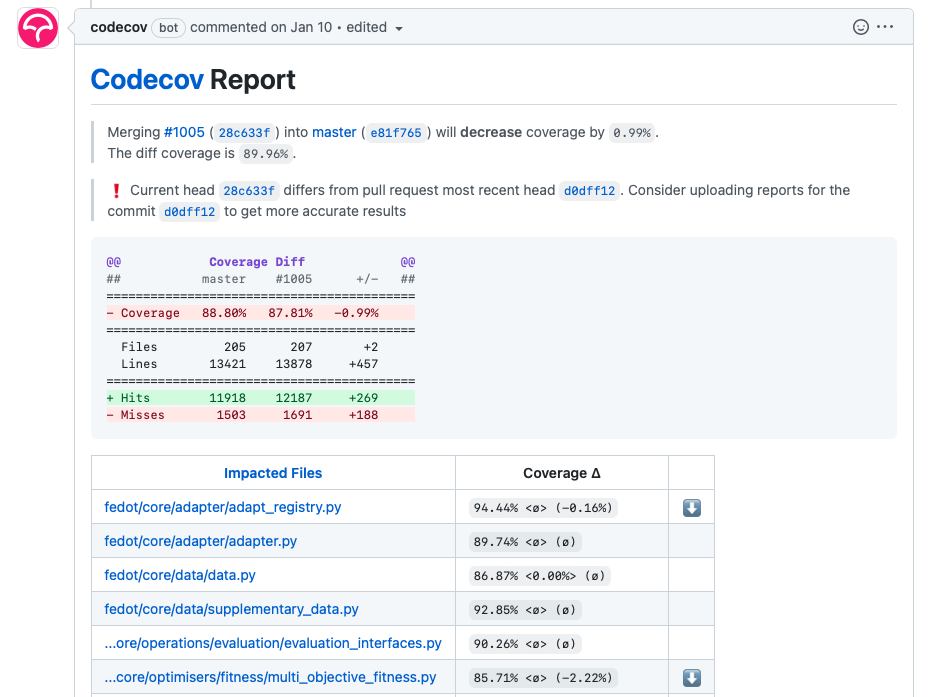

Контроль качества проекта
#########################

Добавление ботов к репозиторию
******************************

PEP8 Speaker
============

`PEP8 Speaker <https://github.com/OrkoHunter/pep8speaks>`_ позволяет отслеживать 
корректность Python кода относительно правил оформления `PEP8 <https://peps.python.org/pep-0008/>`_

В проекте, по решению команды, могут быть определены отступления от классических правил PEP8,
например, допустимая длина строки кода может быть увеличена с 79 символов до 100 или 120 символов.
Некоторые правила PEP8 могут быть игнорированы. 

Все необходимые настройки PEP8 Speaker должны быть прописаны 
`в манифесте бота <https://github.com/OrkoHunter/pep8speaks#configuration>`_ (конфигурационном файле), 
а сам файл с названием ``.pep8speaks.yml`` добавлен в ваш проект. Вы можете полностью скопировать конфигурации, что 
описаны по ссылке выше, однако допускается использовать и упрощенную конфигурацию, 
как в `данном проекте <https://github.com/aimclub/FEDOT/blob/master/.pep8speaks.yml>`_.

Как настроить?
--------------

1. Перейти на `главную страницу <https://github.com/apps/pep8-speaks>`_ бота;
2. Нажать на кнопку ``Configure``
3. Выбрать репозиторий, для которого вы хотите активировать PEP8 Speaker 
   (помните, что вы должны обладать правами администратора в добавляемом проекте)
4. В корневую директорию проекта необходимо добавить манифест ``.pep8speaks.yml`` с настройками, которые 
   вы сами определите (или скопируете стандартрые настройки из `примера <https://github.com/OrkoHunter/pep8speaks#configuration>`_)

Настройка pep8speaks бота от ИТМО
^^^^^^^^^^^^^^^^^^^^^^^^^^^^^^^^^

При использовании оригинального бота вам не гарантируется сохранение приватности кода. В случае, когда вам это необходимо, вы можете воспользоваться ботом, расположенным на выделенном сервере ИТМО. Для этого, вам необходимо выполнить несколько действий:

**Пригласите бота в репозиторий** (Пункт актуален только для приватных репозиториев):

1. Убедитесь, что у вас есть статус Maintainer или Owner для репозитория или группы. Если такового нет, то попросите администратора изменить статус.
2. Перейдите во вкладку ``Settings``
3. В левом меню выберете ``Collaborators``
4. Нажмите на кнопку ``Add people``
5. В появившемся окне введите ``aim-pep8-bot`` и выберете его
6. Нажмите ``Add aim-pep8-bot to this repository``
7. Дождитесь, пока бот примет приглашение (примерно час)

Важно отметить, что бот должен иметь права доступа ко всем репозиториям, для которых вы хотите использовать сервис. 
В случае если Pull Request создается из секретного форка секретного репозитория, бот должен быть добавлен и в этот форк, чтобы получить diff PR. 

**Настройте Github Actions**:

1. Убедитесь, что у вас есть статус Maintainer или Owner для репозитория или группы. Если такового нет, то попросите администратора изменить статус.
2. Перейдите во вкладку ``Settings``
3. В левом меню выберете ``Webhooks``
4. Справа сверху нажмите ``Add webhook``
5. В ``Payload URL`` вставьте ``https://automation.nsslab.onti.actcognitive.org``
6. В поле ``Content type`` выберете ``application/json``
7. Поле ``Secret`` оставьте пустым
8. Далее в разделе ``Which events would you like to trigger this webhook?`` выберете ``Let me select individual events.``
9. Выставите галочку на ``Pull requests`` и **уберите** с ``Pushes``
10. Поставьте галочку ``Active`` и нажмите на кнопку ``Add webhook``

CodeCov
=======

`CodeCov <https://about.codecov.io>`_  - это инструмент, предоставляющий метрики и информацию о результатах
тестов с помощью отчетов о покрытии кода. Отчеты о покрытии используются для определения того, 
какие строки кода были протестированы, а какие нет, а также возмжное наличие ошибок в коде.

CodeCov формирует отчет внутри Pull Request после каждого коммита, что позволяет просматривать 
статистику на каждом этапе работы над проектом.

Как настроить?
--------------

1. Интегрировать инструмент в репозиторий по `инструкции <https://docs.codecov.com/docs/quick-start>`_
   (обратите внимание, что для настройки в GitHub существует `дополнительный раздел <https://docs.codecov.com/docs/github-tutorial>`_)
2. Добавить в репозиторий манифест ``.codecov.yml``. CodeCov обладает большим набором статистик и метрик,
   которые могут отображаться в отчете, выбрать необходимые для своего проекта можно среди `наиболее популярных <https://docs.codecov.com/docs/common-recipe-list>`_.
   Пример упрощенного файла с конфигурациями можно найти `по ссылке <https://github.com/aimclub/FEDOT/blob/master/.codecov.yml>`_. 
